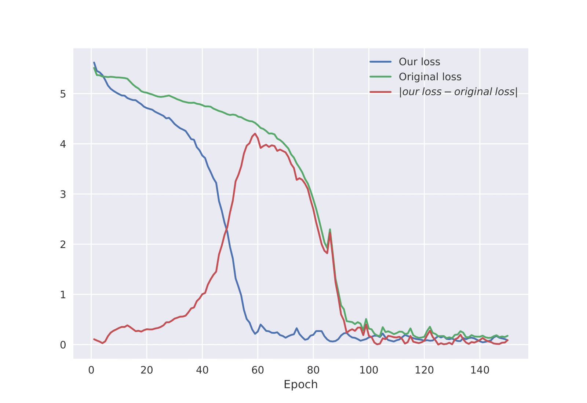

## Fundamentals of reproducible research and free software project - Vision Transformer

This directory contains the code of our custom implementation of the [Vision Transformer](https://arxiv.org/abs/2010.11929),
built only using the information provided in the paper. We also compare our implementation to the original one.

## Usage
1. Install requirements (PyTorch, torchvision, timm, tqdm).
    ```
    pip install -r ../requirements.txt
    ```

2. Download ImageNet-ILSVRC 2012 validation dataset and extract it it in a `ImageNet` directory.
3. Execute the `train_eval.py` script: `python train_eval.py`.

## Results

We see that the losses converge to the same value and have the same shape.
However, our implementation converges faster. It is probably due to the random initialization of the weights.
 